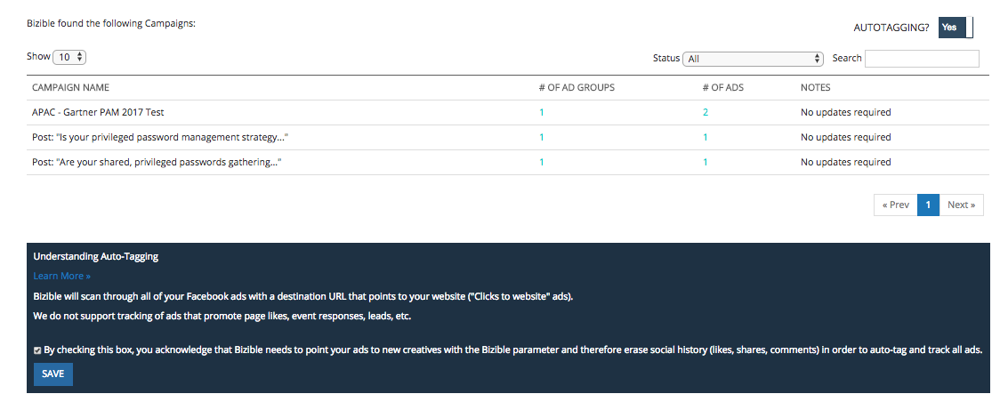

# Facebook API {#facebook-api}

## Introduction   
{#introduction}

Similar to our AdWords & Bing Ads integrations, our Facebook integration does two fundamental actions: &nbsp;

* `Auto-tag all Facebook Ads with a Bizible parameter (_bf)`
* `Download ad cost information across all active Facebook ads`

## How to Configure the Facebook Integration {#how-to-configure-the-facebook-integration}

As for setup, there are seven steps to be completed within Bizible's app.

1. Navigate to [apps.bizible.com](http://apps.bizible.com) and log-in.
1. Under My Account select **Settings.**
1. Under&nbsp;Integrations&nbsp;select **Connections.**
1. Select **Set Up New Ads Connection**, and a pop-up will appear.&nbsp;Select **Facebook** and log-in using your Facebook credentials.&nbsp;

   >[!NOTE]
   >
   >The person connecting the Facebook Ads account needs to be an admin within the Facebook Ads account.

1. Once Bizible is connected to your Facebook account, click the pencil icon next to the account.
1. Within this view, move the 'Auto-tagging?' toggle to 'Yes.' Then select the check box found in the Learn More section to agree to the terms and conditions. Make sure the Auto-tagging toggle is still set to 'Yes'.

## Connecting the Account {#connecting-the-account}

## Enabling Autotagging {#enabling-autotagging}

>[!NOTE]
>
>`If you enable auto-tagging, we'll reset the conversion history and social proof of all of the ads that we tag. We highly recommend` [exporting this data as a CSV](http://www.facebook.com/business/help/205067636197240) before you enable auto-tagging.&nbsp;

Once you've enabled the integration, Bizible will start downloading ad level cost into the Bizible Marketing ROI Dashboard.&nbsp;

For the integration to properly work, you'll need to enable auto-tagging on your Facebook account. This will allow our system to add a&nbsp; _bf parameter across all ad links. This process will add the new parameter on top of any other tracking parameters you've already added to your Facebook ads.&nbsp;

## Field Mapping {#field-mapping}

<table> 
 <colgroup> 
  <col> 
  <col> 
 </colgroup> 
 <tbody> 
  <tr> 
   <th>
<strong>Touchpoint Field</strong>
</th> 
   <th>
<strong>Value</strong>
</th> 
  </tr> 
  <tr> 
   <td>
Ad Campaign Id
</td> 
   <td>
[Facebook Campaign Id]
</td> 
  </tr> 
  <tr> 
   <td>
Ad Campaign Name 
</td> 
   <td>
[Facebook Campaign Name], or [utm_campaign] if provided
</td> 
  </tr> 
  <tr> 
   <td>
Ad Group Id
</td> 
   <td>
[Facebook Ad Set Id]
</td> 
  </tr> 
  <tr> 
   <td>
Ad Group Name
</td> 
   <td>
[Facebook Ad Set Name]
</td> 
  </tr> 
  <tr> 
   <td>
Touchpoint Source
</td> 
   <td>
“Facebook”, or [utm_source] if provided
</td> 
  </tr> 
  <tr> 
   <td>
Medium
</td> 
   <td>
“Social”, or [utm_medium] if provided
</td> 
  </tr> 
  <tr> 
   <td>
Ad Id, or Creative_Unique_Id (Data Warehouse)
</td> 
   <td>
[custom Id generated from utm_content]
</td> 
  </tr> 
  <tr> 
   <td>
Ad Content, or Creative_Name (Data Warehouse)
</td> 
   <td>
[utm_content] if provided
</td> 
  </tr> 
  <tr> 
   <td>
Keyword Text, or Keyword_Name (Data Warehouse)
</td> 
   <td>
[utm_term] if provided
</td> 
  </tr> 
  <tr> 
   <td>
Ad_Unique_Id (Data Warehouse)
</td> 
   <td>
[Facebook Ad Id]
</td> 
  </tr> 
  <tr> 
   <td>
Ad_Name (Data Warehouse)
</td> 
   <td>
[Facebook Ad Name]
</td> 
  </tr> 
  <tr> 
   <td>
Keyword_Unique_Id (Data Warehouse)
</td> 
   <td>
[custom Id generated from utm_term]
</td> 
  </tr> 
  <tr> 
   <td>
Ad_Provider (Data Warehouse)
</td> 
   <td>
“Facebook”
</td> 
  </tr> 
  <tr> 
   <td>
Account_Unique_ID (Data Warehouse)
</td> 
   <td>
[Facebook Account #]
</td> 
  </tr> 
  <tr> 
   <td>
Account_Name (Data Warehouse)
</td> 
   <td>
[Facebook Account Name]
</td> 
  </tr> 
 </tbody> 
</table>

## FAQ   
{#faq}

##### Q: What Facebook Ads are supported by Bizible?  {#q-what-facebook-ads-are-supported-by-bizible}

A: Carousel, Single Image. Not Video, Slideshow or Collection at this time.&nbsp;

Q: What is social proof?

A: Social proof is visible engagement such as likes, clicks, comments, and shares.

Q: What happens when Bizible tags the Ad?

A: Facebook does not allow ads to be edited so Bizible needs to delete the creative, which contains the Destination URL, and then re-create the ad with the new parameters.&nbsp;

Q: Why does Bizible update all Facebook Ads?

A: Bizible's process is to tag all ads in case they are re-activated.&nbsp;

Q: What permission does the connected user need?

A: ads_management, email

Q: How long can it take to import spend data?

A: 1 hour

Q: How long can it take to import ad data?

A: 4 hours
