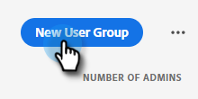
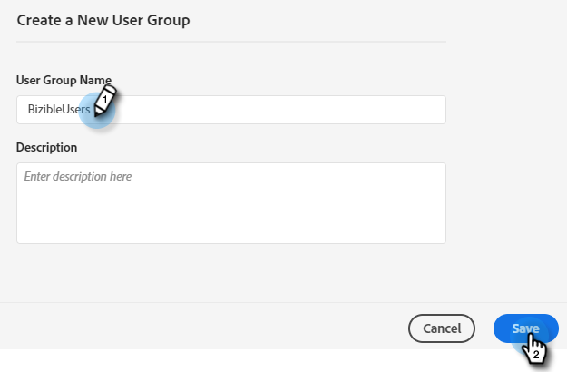
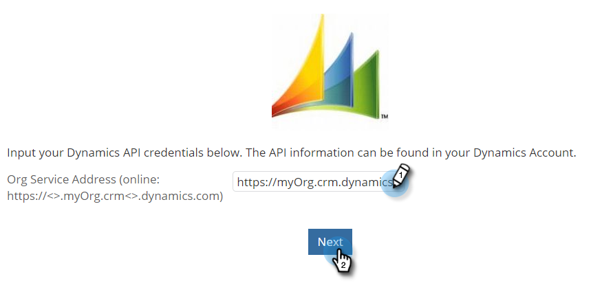

# Microsoft Dynamics CRM Installation Guide {#microsoft-dynamics-crm-installation-guide}

## Supported Versions {#supported-versions}

Bizible supports the following Microsoft Dynamics CRM versions:

* Microsoft Dynamics 2016 (Online and On-Premise)
* Microsoft Dynamics 365 (Online and On-Premise)

For connection and authentication, Bizible supports the following Active Directory Federated Services (ADFS) versions:

* ADFS 4.0 - Windows Server 2016
* ADFS 5.0 - Windows Server 2019

## Install the Managed Solution {#install-the-managed-solution}

Install the zip file within Dynamics CRM. Your Solutions Engineer will provide you with the installation file via email.

Settings > Customizations > Solutions > Import (button) > Choose File

>[!NOTE]
>
>The following two screenshots may vary slightly from yours, as they were taken during a solution upgrade.

## Bizible User Permissions {#bizible-user-permissions}

We recommend creating a dedicated Bizible User within Dynamics for us to export and import data through to avoid any issues with other users in your CRM. Take note of the username and password as well as the endpoint URL as this will be used when creating the Bizible account.

## Security Roles {#security-roles}

If your organization uses Dynamics Security Roles, please make sure the connected user, or the dedicated Bizible User has sufficient read/write permissions to the required entities.

Security Roles are located here: Settings > Security > Security Roles

For Bizible custom entities, we will need full permissions across all of our entities.

>[!NOTE]
>
>Users who will be closing opportunities also will need the full permissions.

For Dynamics standard entities, please refer to Bizible’s Dynamics schema document. At a high level, Bizible just needs to read in certain entities in order to gather the appropriate data and write to custom fields that will get installed with the managed solution. We will not create new standard records, nor will we update any standard fields.

## Include Touchpoints on Page Layouts: {#include-touchpoints-on-page-layouts}

1. For each Entity, navigate to the Form Editor. You can either find this under Settings > Customizations > Customize the System > `[Entity]` > Forms. Or you can find it on the settings while you’re viewing a record.

   * The entities to configure: Account, Opportunity, Contact, Lead, and Campaign.

   

1. Page Layouts: first add a “One Column” tile in the section you want the Touchpoints to live. Within that new column, we will need a sub grid added to each form within your Account, Opportunity, Contact, and Lead entities.

   

   

1. Select the object (Bizible Attribution Touchpoints or Bizible Touchpoints) that should render in the subgrid, which depends on the object relationship. Optionally, change the columns that will display by clicking the Edit button. A default layout has been set by the managed solution.

   Bizible Attribution Touchpoint Subgrid - Accounts, Opportunities, and Contact  
   Bizible Touchpoint Subgrid - Leads and Contacts

   

1. Once you’re done updating the form, publish and save your changes.

## Schema-related Considerations {#schema-related-considerations}

**Revenue**

Bizible points to the standard Actual Revenue field by default. If you are not using this, please explain how you report on revenue to your Solutions Engineer or Success Manager as a custom workflow will be needed.

**Close Date**

Bizible points to the Actual Close Date field out of the box. If you are not using this or also use the Estimated Close Date field, please explain your process to your Solutions Engineer or Success Manager. A custom workflow may be need to account for both fields.
 &nbsp;

## Set up Your Adobe Admin Console and Identity Provider {#set-up-your-adobe-admin-console-and-identity-provider}

The first step to using Bizible is to create and sign-in to your provisioned Adobe Admin Console. If you haven't already received the email with log in instructions, please contact your Bizible Account Representative.

As a product within the Adobe Suite, Bizible leverages the full functionality of Adobe Admin Console for Identity Management. More resources can be found here: https://helpx.adobe.com/enterprise/using/admin-console.html.

We recommend reviewing all of the resources, best practices, and options available to you for Identity Management: https://helpx.adobe.com/enterprise/using/set-up-identity.html.

For guidance and review of setting up your Identity Management within the Adobe Admin Console, please reach out to your Bizible Account Representative.

In order to facilitate user authentication and authorization with your Bizible instance(s), the following steps are required within the Adobe Admin Console:

**Setting Up the Bizible Product Card**

>[!NOTE]
>
>This section applies to those provisioned _after_ 12/7/2020. For those provisioned prior to this date, please make sure you follow the steps to setup Global User Groups in the 'Setting up User Groups in the Adobe Admin Console' section below.

Upon accessing the Adobe Admin Console, you will see your Bizible Product instance(s) present in the Overview section.

   

Clicking the Bizible Product Card will show you all of your Bizible instance(s). By default, each Bizible Instance has its own profile, called 'Bizible'. Any Admins or Users added to this or any other profile within this instance will be able to log in to Bizible.

   

No action is required to create a new profile or setup anything specific within the Bizible Product instance(s).

To begin adding users who can access Bizible, please refer to the [Adding Bizible Admins and Bizible Users](#adding-bizible-admins-and-bizible-users) section below.

**Setting up User Groups in the Adobe Admin Console**

>[!NOTE]
>
>This section only applies to those provisioned _before_ 12/7/2020. If you were provisioned prior to 12/7/2020, you will not see a Bizible Product Card, and the steps below are required in the Adobe Admin Console for User Management. For those provisioned after 12/7/2020, please instead refer to the 'Setting Up the Bizible Product Card' section above.

1. Navigate to https://adminconsole.adobe.com/overview.

1. In the Admin Console, click **Users**.

   

1. Click **User Groups**.

   

1. Click **New User Group**.

   

1. Under User Group Name, enter "BizibleAdmins" and click **Save**.

   

1. Click **New User Group** again.

   

1. Under User Group Name, enter "BizibleUsers" and click **Save**.

   

Now learn how to add people to these groups...

## Adding Bizible Admins and Bizible Users {#adding-bizible-admins-and-bizible-users}

After you've created User Groups or have the Default Product Profile set up in your Bizible instance(s), the next step is to grant access to the Bizible application by adding users. This can be done in the admins and users directory of the Bizible product card.

>[!NOTE]
>
>If you were provisioned prior to 12/7/2020, users must be added to one of the two groups created here. This is where all Users who wish to access Bizible must be added, including Adobe Admin Console Administrators.

|User Group|Description|
|---|---|
|BizibleAdmins|these are administrators and power users of the Bizible Application with full ability to update and manage Bizible-specific configuration options|
|BizibleUsers|these are standard users of the Bizible Application with read only permissions within the Bizible application|

When adding a user to their respective group, you'll see their [Identity Type listed](https://helpx.adobe.com/enterprise/admin-guide.html/enterprise/using/set-up-identity.ug.html).

**Signing in to Bizible**

After a user has been added to a group or a Product Profile, they're able to access their Bizible instance(s) by choosing the **Sign in with Adobe ID** option at [https://apps.bizible.com](https://apps.bizible.com).

   

## Configuring your Connections and Data Providers {#configuring-your-connections-and-data-providers}

Once you've logged-in to the Bizible application as a user in the BizibleAdmins group within the Adobe Admin Console, it's time to set up your various data connections.

**CRM as a Data Provider**

1. In your Bizible account, click the **My Account** drop-down and select **Settings**.

   

1. Under Integrations in the left nav, click **Connections**.

   

1. Click the **Set Up New CRM Connection** button.

   

1. Next to Microsoft Dynamics CRM, click the **Connect** button.

   

1. Select Credentials or OAuth.

   

   >[!NOTE]
   >
   >For more information on OAuth, please visit [this article](/help/bizible-and-dynamics/getting-started-with-bizible-and-dynamics/oauth-with-azure-active-directory-for-dynamics-crm.md). If you have any questions about the process, please contact your Bizible Account representative.

1. In this example, we've chosen Credentials. Enter your credentials and click **Next**.

After connecting, you'll see the details of your Dynamics connection in the CRM/MAP Connections list.

**Ad Account Connections**

To connect your Ad Accounts with Bizible, start by visiting the Connections tab within the Bizible application.

1. Follow Steps 1 & 2 from the above _CRM as a Data Provider_ section.

1. Click the **Set up New CRM Connection** button.

   

1. Select your desired platform.

   

**Bizible Javascript**

In order for Bizible to track your web activities, there are multiple steps for setup.

1. Click the **My Account** drop-down and select **Account Configuration**.

   

1. Enter your phone number. For Website, enter your primary root domain that will be used for Bizible tracking on your website. Click **Save** when done.

   

   >[!NOTE]
   >
   >To add multiple root domains, please contact your Bizible Account Representative.

1. The [Bizible JavaScript](/help/bizible-tracking/setting-up-tracking/adding-bizible-script.md) then needs to be placed across the entire site and landing pages. We recommend hardcoding the script within the head of your landing pages or adding through a Tag Management System such as [Google Tag Manager](/help/bizible-tracking/setting-up-tracking/adding-bizible-script-via-google-tag-manager.md).
