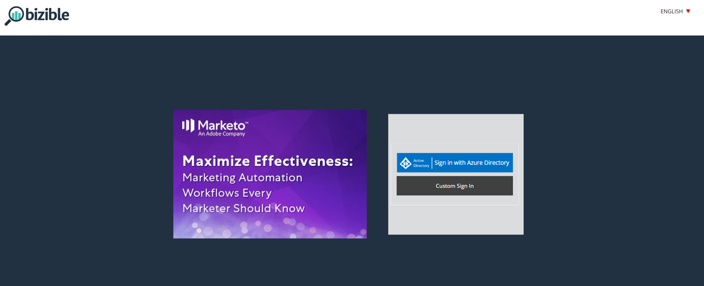
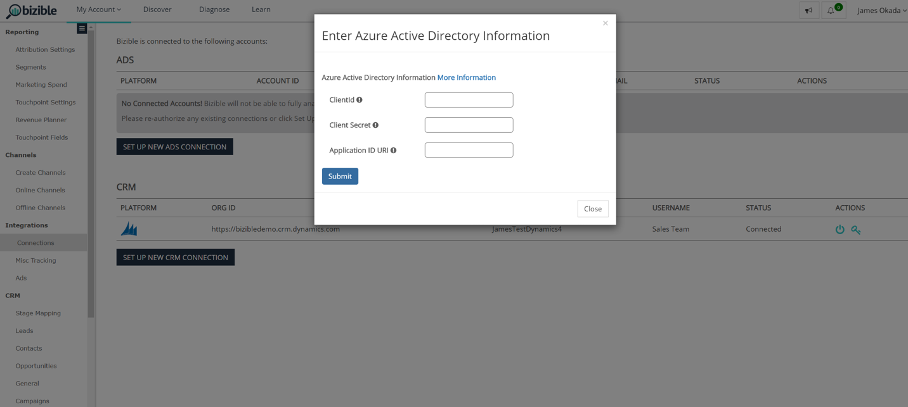

# OAuth with Azure Active Directory for Dynamics CRM {#oauth-with-azure-active-directory-for-dynamics-crm}

## Who’s Affected {#who-s-affected}

This setup is for new Bizible customers using Dynamics CRM with an Azure Active Directory account, or for customers that want to migrate from their legacy username and password login to Azure Active Directory with OAuth.

## Set Up New Application {#set-up-new-application}

1. Sign-in to your [Azure Portal](http://portal.azure.com/#home).
1. Choose your Azure AD tenant by clicking on your account in the top-right corner of the page, followed by clicking on the Switch Directory navigation and then selecting the appropriate tenant (skip this step if you only have one Azure AD tenant under your account or if you've already selected the appropriate Azure AD tenant).

   

1. Search for "Azure Active Directory" in the search bar and click the name to open.

   

1. Click **App Registrations** in the left-hand menu.

   

1. Click **New Registration** at the top.

   

1. Follow the prompts and create a new application. It doesn't matter if it's a web application or a public client (mobile & desktop) application, but if you'd like specific examples for web applications or public client applications, check out our [quickstarts](http://docs.microsoft.com/en-us/azure/active-directory/develop/v1-overview).  
   a. Name is the application name and describes your application to end users.  
   b. Under Supported account types, select Accounts in any organizational directory and personal Microsoft accounts.  
   c. Provide the Redirect URI. For Web Applications, this is the base URL of your app where users can sign in. For example, `http://localhost:12345`. For public client (mobile & desktop), Azure AD uses it to return token responses. Enter a value specific to your application. For example, `http://MyFirstAADApp`.
1. Once you've completed registration, Azure AD will assign your application a unique client identifier (the Application ID). You need this value in the next section, so copy it from the application page.
1. To find your application in the Azure portal, click **App Registrations**, then click **All Applications**. Open your newly created application
1. Click **Authentication** in the left-hand menu.

   

1. Add Bizible’s redirect URLs: * `https://apps.bizible.com/OAuth2`* and * `http://apps.bizible.com/OAuth2?identityOnly=true`* to the list of Redirect URLs.

   

1. From here, enter “enterprise” in the search box and click on Enterprise Applications

   

1. Again, find and open your new application from the list of applications
1. From the Permissions tab, make sure that the correct permissions are assigned to the Azure Active Directory application

   

1. From the "Users and Groups" tab, make sure that the valid "Users and Groups" are assigned to the Application.   
  
   

## Creating a New Bizible Account {#creating-a-new-bizible-account}

1. To create a new Bizible account for a Dynamics customer, go to: [https://apps.bizible.com/Dynamics/Signup](http://apps.bizible.com/Dynamics/Signup).
1. You will be prompted to fill out:

   a. Company Name  
   b. Phone Number  
   c. Website  
   d. Client Id

   i. This was the Id from Step #7 in Set Up New Application. If you didn’t write it down, the Application Id is displayed in the Settings of the App registration

   e. Client Secret

   i. This is the application secret created in the Azure Portal for your application under Certificates & Secrets

     
  
   f. Application Id URL

   i. The Application ID URL of the target web API (secured resource). To find the App ID URL, in the Azure Portal, click Azure Active Directory, click Application registrations, open the application's Settings page, then click Properties. It may also be an external resource like [https://graph.microsoft.com](http://graph.microsoft.com).   
   ii. This is normally the url of the dynamics instance.

1. Done. You can now click **Submit** to create your Bizible account.

## Logging into the Bizible Application {#logging-into-the-bizible-application}

1. Navigate to `https://apps.bizible.com/business/{accountId}`, where `{accountId}` is your Bizible account Id. Your Implementation team will provide this to you.
1. Click **Sign in with Active Directory**. If you’re already authenticated with Azure Active Directory, you’ll be signed in to Bizible. Otherwise, you’ll sign-in with your Azure Active Directory credentials.

   

## Re-authenticating your Dynamics Account {#re-authenticating-your-dynamics-account}

1. When you’re in the Bizible application, go to **My Settings** > **Settings** > **Connections**.
1. Click on the key icon in the CRM section next to the Dynamics connection.
1. Once the key is clicked, a pop-up will appear and you’ll be prompted to enter the Client Id, Client Secret, and Application Id URI, similar to the signup flow.

   

1. After you click **Submit**, you’ll be prompted to sign-in with Azure Active Directory. When the authentication is successful, your Dynamics account will be re-authorized within Bizible.

